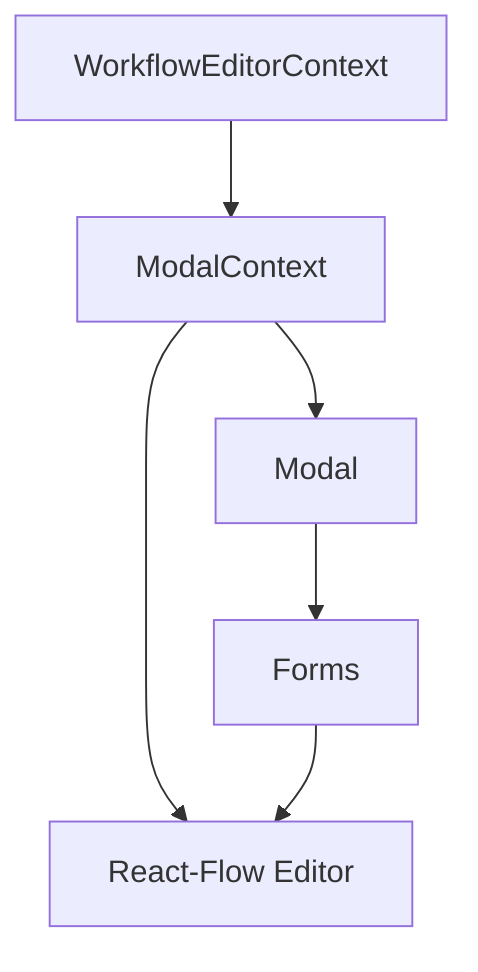

# Workflow Builder

## Overview

A React-based visual workflow builder application that allows users to create workflows with different types of nodes through a drag-and-drop interface.

``View the deployed project at https://workflow-frontend-challenge.vercel.app/``

## Features

- **Node Types**: Start, Form, Conditional, API, and End blocks
- **Visual Canvas**: ReactFlow-powered workflow canvas with drag-and-drop support
- **Block Panel**: Left sidebar with draggable workflow blocks
- **Modern UI**: Built with @radix-ui/themes design system
- **TypeScript**: Full TypeScript support throughout the application

## Prerequisites

- Node.js (version 18 or higher)
- npm or yarn package manager

## Getting Started

1. **Clone the repository**

   ```bash
   git clone https://github.com/ering30/workflow-frontend-challenge.git
   cd workflow-frontend-challenge
   ```

2. **Install dependencies**

   ```bash
   npm install
   ```

3. **Start the development server**

   ```bash
   npm run dev
   ```

4. **Open your browser**
   Navigate to `http://localhost:5173` to view the application

## Available Scripts

- `npm run dev` - Start development server
- `npm run build` - Build for production
- `npm run lint` - Run ESLint
- `npm run format` - Format code with Prettier
- `npm test` - Run test package

## Tech Stack

- **React 18** with TypeScript
- **@radix-ui/themes** for UI components
- **ReactFlow** for workflow canvas
- **React Hook Form** for form management
- **Vite** for build tooling
- **Jest / Vitest / React Testing Library** for unit & integration tests

## Project Structure

```
src/
├── components/
│   ├── WorkflowEditor/          # Main workflow canvas
│   ├── BlockPanel/              # Left panel with draggable blocks
│   ├── DraggableBlockOverlay/   # Presentational components to enable dragging onto canvas
│   ├── modals/                  # Modal and related form components
│   └── nodes/                   # Node components
│       ├── StartNode.tsx
│       ├── FormNode.tsx
│       ├── ConditionalNode.tsx
│       ├── ApiNode.tsx
│       └── EndNode.tsx
├── contexts/                    # Shared component data
├── hooks/                       # Component logic 
├── lib/                         # Types & utilities
├── pages/
│   ├── Index.tsx                # App entry point
│   └── NotFound.tsx
└── main.tsx                     # App root file
├── tests/                       # Test suite
```

## Design Decisions

- Reduce component size to reduce file complexity, by splitting components into smaller or reusable pieces e.g. modal. 
- Co-locating and nesting related components together
- Separate out logic from components into hooks
- Co-locating local hooks with components to maintain separation of concerns and simplify maintainance
- Use global hooks where needed, but prefer local hooks
- Use context providers to share common global variables
- ``src/lib`` folder to contain utility functions and types, can easily be ignored from dist in CI if needed
- Locate tests in root folder to maintain separation
- Use radix-ui library to avoid introducing additional dependencies
- Node and Block components are easily extended and maintained by modifying ``useDraggableBlocks.ts``, ``NodeTypes.ts``, and adding to the ``src/components/nodes/components`` folder. Similarly, additional type definitions can be exported from ``src/lib/types``. 

Data flow: 



## Trade-offs

- Time management: moving into implementation prior to carefully examining relevant documentation; this led to incorrect assumptions and inefficiencies 
- Custom form validation to keep project complexity low and avoid additional dependencies; this increased complexity and time
- Custom input handling, errors and validation on each field due to data structures; related to both points above. This could have been achieved in a simpler and more streamlined way with reusable components and hooks, and/ or form validation library

## Testing strategy

- Primarily integration testing of components, with some smaller unit tests of utility functions
- Provides coverage of user interactions, rendering and state and includes functionality in hooks/ context without requiring explicit additional tests for those. 

## Reflection 
I started the challenge without fully reading through documentation, which led to some incorrect assumptions and avoidable mistakes.

As I progressed, I realised I’d missed key information that would have helped guide a better approach from the start.

In hindsight, I would take more time upfront to understand the context and requirements before jumping into the build.